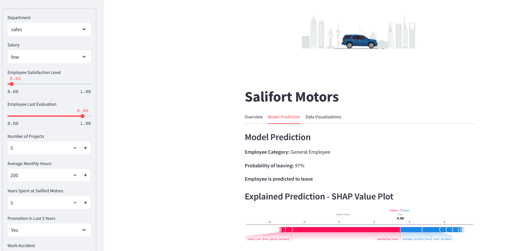
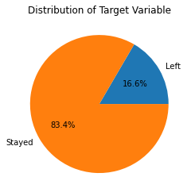
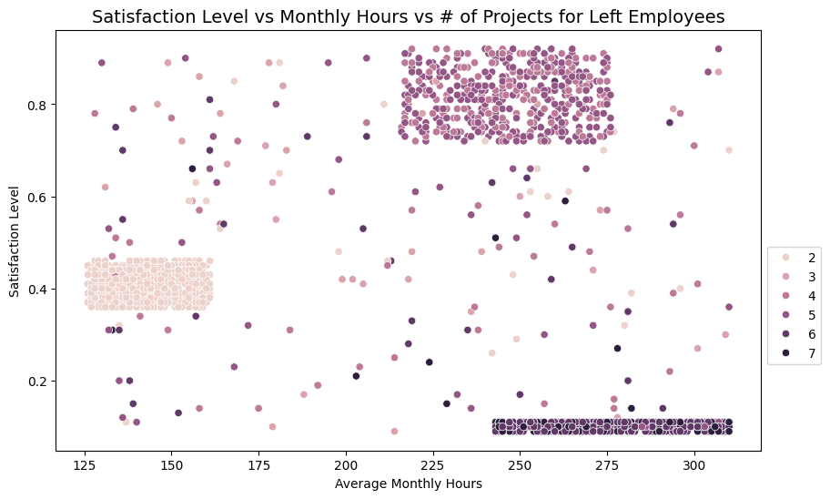
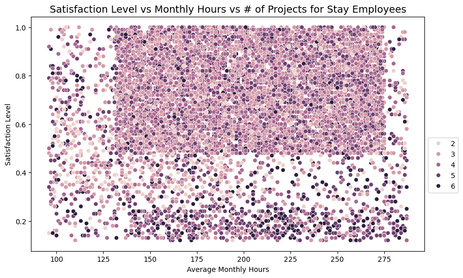

# Salifort_Motors_Employee_Retention_Project
The Capstone project for the Google Advanced Data Analytics Certificate

#### View the Interactive Web App Here: 
[Salifort Motors Project Web App](https://salifort-motors-employee-retention.streamlit.app/)

Dataset can be downloaded from Kaggle: [Salifort Motors Dataset](https://www.kaggle.com/datasets/leviiiest/salifort-motor-hr-dataset)

## Project Evaluation

- **Model Accuracy:**
   -  98% for classifying Employee Churn.

- **Model Recall:**
   - 93% of the time, the model will correctly predict the employees who will leave.
 

### There are three main groups of employees who are likely to leave:

1. **Low Satisfaction/High Performers:**
    - 4-5 years with the company but not promotion
    - Average Monthly Hours greater than 240
    - 6-7 projects
    - High Evaluation Scores
    - Low Satisfaction Scores

- **Recommendation:** These employees are very valuable to the company. They are due for a promotion and likely have too high of a work load, so reduce the work load and/or offer a promotion

2. **Mid Satisfaction/Low Performers:**
    - 3 years with the company
    - Average Monthly Hours less than 165
    - 2-3 projects
    - Low Evaluation Scores
    - Mid Satisfaction Scores

- **Recommendation:** These employees are currently not very valuable to the company. They can take some of the workload from the High  Performers. This could improve retention of the high performers and also possibly increase the retention of this work group. They are possibly bored with the low amount of work. Since this group is not as productive, if they still choose to leave, even after the increase in projects/hours, then they will not be as detrimental. They are typically newer employees and do not drain the company knowledge when they leave.

3. **High Satisfaction/Mid Performers:**
    - Greater than 5 years at the company
    - No Promotion
    - Average Monthly Hours between 215-275
    - 3-5 Projects

- **Recommenation:** These employees are valuable to the company. They have been at the company a long time and likely have a lot of knowledge of company practices. Without a promotion, they are likely to leave. They are not overworked so their workload should not be redistributed. By offering a promotion, their likelihood of leaving will be reduced.
       
       

#### Model Use Case:

**This model can predict employees that are likely to leave. Then the employee can be grouped into these three categories and managers can propose better changes that will positively impact the employee.**

## Exploratory Data Analysis:

### Imbalanced Target

### Pairplot Analysis

This is very insightful and by using the hue set to the target, there are some very significant patterns viewable.

-  **Satisfaction Level:**
    - If the satisfaction level is low, then the employee tends to leave.
- **Number of Projects:**
    - If the number of projects is high, then the employee tends to leave.
- **Average Monthly Hours:**
    - If the number of average monthly hours is high, then the employee tends to leave.
- **Time Spend at the Company:**
    - The employees who leave, tend to be 5 for fewer years with a combination of either high number of projects or high number of average monthly hours or very low satisfaction level.

### Employee Leaving Cohorts
**When looking at the scatterplot below, there are three cohorts of employees can be seen to leave the company in a higher probability than the average employee.**

### Employee Staying
**When looking at employees who stay, there is fairly evenly distributed scatter among these same characteristics. This signifies these three cohorts are significant.**

## Feature Engineering

- **One of the cohorts with high likelihood of leaving is the group that work >240 monthly hours, have a high evaluation score, but low satisfaction. To better express this relationship between long hours and high evaluation score but low satisfaction, a formula is implemented to turn this relationship into a numeric value.**
