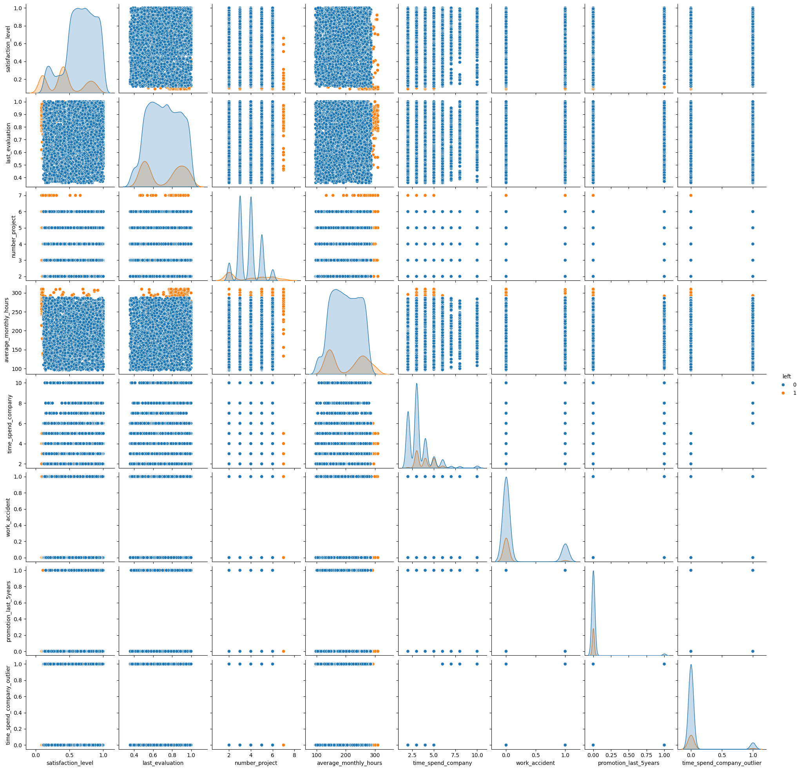
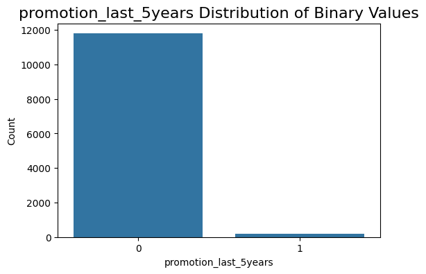
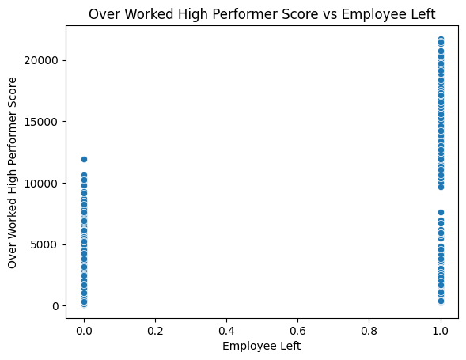
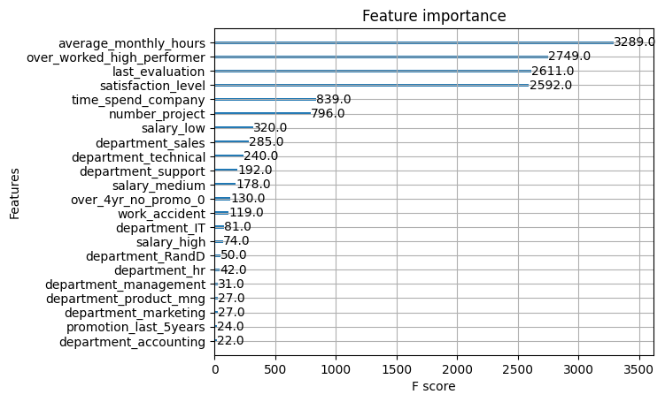
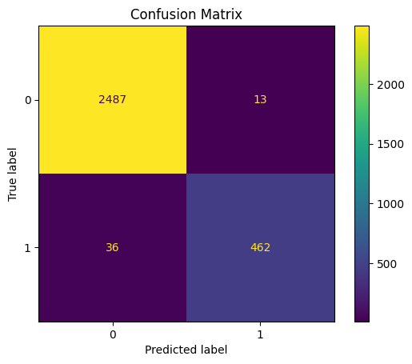

# Salifort_Motors_Employee_Retention_Project
#### Model Use Case:

This model can predict employees that are likely to leave. Then any high risk employees can be grouped into one of the three high-risk cohorts and managers can propose changes, such as a promotion or reduced hours, that may entice the employee to stay.

#### View the Interactive Web App Here: 
[Salifort Motors Project Web App](https://salifort-motors-employee-retention.streamlit.app/)

Dataset can be downloaded from Kaggle: [Salifort Motors Dataset](https://www.kaggle.com/datasets/leviiiest/salifort-motor-hr-dataset)

## Project Evaluation

- **Final Model Accuracy:**
   -  98% for classifying Employee Churn.

- **Final Model Recall:**
   - 93% of the time, the model will correctly predict the employees who will leave.
 

## Exploratory Data Analysis:

### Imbalanced Target

#### Adjustments for Imbalanced Target:
1. Use hyperparameter to use weights for balancing
    - **XGBoost:** scale_pos_weight
    - **RandomForest:** class_weight 
2. Stratify data by target on all splits

### Pairplot Analysis

This is very insightful and by using the hue set to the target, there are some very significant patterns viewable.

-  **Satisfaction Level:**
    - If the satisfaction level is low, then the employee tends to leave.
- **Number of Projects:**
    - If the number of projects is high, then the employee tends to leave.
- **Average Monthly Hours:**
    - If the number of average monthly hours is high, then the employee tends to leave.
- **Time Spend at the Company:**
    - The employees who leave, tend to be 5 for fewer years with a combination of either high number of projects or high number of average monthly hours or very low satisfaction level.

### Employee Leaving Cohorts
**When looking at the scatterplot below, there are three cohorts of employees can be seen to leave the company in a higher probability than the average employee.**

### Employee Staying
**When looking at employees who stay, there is fairly evenly distributed scatter among these same characteristics. This signifies these three cohorts are significant.**

### Promotion in the Last 5 Years
**There are very few employees who have gotten a promotion in the last 5 years, as can be seen in the plot below. Perhaps it needs to be adjusted for just employees who have been at the company for 5 years or more to have real significance. Because new employees would not be expected to have a promotion.**

## Feature Engineering

- **One of the cohorts with high likelihood of leaving is the group that work >240 monthly hours, have a high evaluation score, but low satisfaction. To better express this relationship between long hours and high evaluation score but low satisfaction, a formula is implemented to turn this relationship into a numeric value.**

### New Features: 
1. **Over Worked High Performer:** (number of projects X number of monthly hours X evaluation score) / satisfaction score
2. **Over 4 Years No Promotion:** if an employee has worked more than 4 years not had a promotion. This eliminates the newer employees who would not be expected to get a promotion.

### Over Worked High Performer Visualization

### There are three main groups of employees who are likely to leave:

1. **Low Satisfaction/High Performers:**
    - 4-5 years with the company but not promotion
    - Average Monthly Hours greater than 240
    - 6-7 projects
    - High Evaluation Scores
    - Low Satisfaction Scores

- **Recommendation:** These employees are very valuable to the company. They are due for a promotion and likely have too high of a work load, so reduce the work load and/or offer a promotion

2. **Mid Satisfaction/Low Performers:**
    - 3 years with the company
    - Average Monthly Hours less than 165
    - 2-3 projects
    - Low Evaluation Scores
    - Mid Satisfaction Scores

- **Recommendation:** These employees are currently not very valuable to the company. They can take some of the workload from the High  Performers. This could improve retention of the high performers and also possibly increase the retention of this work group. They are possibly bored with the low amount of work. Since this group is not as productive, if they still choose to leave, even after the increase in projects/hours, then they will not be as detrimental. They are typically newer employees and do not drain the company knowledge when they leave.

3. **High Satisfaction/Mid Performers:**
    - Greater than 5 years at the company
    - No Promotion
    - Average Monthly Hours between 215-275
    - 3-5 Projects

- **Recommendation:** These employees are valuable to the company. They have been at the company a long time and likely have a lot of knowledge of company practices. Without a promotion, they are likely to leave. They are not overworked so their workload should not be redistributed. By offering a promotion, their likelihood of leaving will be reduced.

### Feature Importance

**Key Takeaways:**
- **Average Monthly Hours**
    - This feature has the **most impact** on retention and if an employee is predicted to leave then the hours of the employee should be viewed to see if they are **over-worked** and then reduce the hours if so.
- **Over Worked High Performer**
    - This feature takes into account the **hours, project, satisfaction, and performance review**. A **high score** means that an employee does **lots of good work** but is **not satisfied**. This assigns value to the employee and if a predicted to leave employee has a high Over Worked High Performer score, they should be aggressively target for retention.
- **Last Evaluation and Satisfaction Level**
    - While these two are expressed in the Over Worked High Performer, this plot shows that they are main contributors to employee leaving. There is a cohort of users who leave who have high satisfaction and a low evaluation score, so they can be identified with this combination of features.
- **Over 4 Years No Promotion**
    -  This feature **does not score high**. Therefor, it may be **less useful to offer a promotion** than to **reduce projects or hours**. But as noticed in the EDA, the distribution of **promotion data is very imbalanced** and **the signal may not strong enough**. Therefor, managers may want to offer the option of either a promotion or a reduced workload. 

###  Model Performance:

Final Model: **XGBoost Classifier with All Features**

#### Confusion Matrix on Test Set

